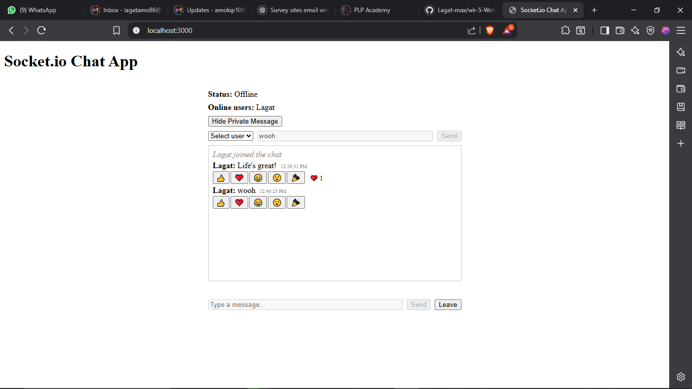

[](https://classroom.github.com/online_ide?assignment_repo_id=19935428&assignment_repo_type=AssignmentRepo)
# Real-Time Chat Application with Socket.io

## Project Overview
A real-time chat application built with Node.js, Express, Socket.io, and React. It supports global and private messaging, live notifications, typing indicators, online status, message reactions, and browser notifications.

## Setup Instructions

### Prerequisites
- Node.js (v18 or higher)
- npm

### 1. Clone the repository
```
git clone <your-repo-url>
cd week-5-web-sockets-assignment-Lagat-max
```

### 2. Install server dependencies
```
cd server
npm install
```

### 3. Install client dependencies
```
cd ../client
npm install
```

### 4. Start the servers
- In one terminal:
  ```
  cd server
  npm run dev
  ```
- In another terminal:
  ```
  cd client
  npm start
  ```

### 5. Open the app
- Visit [http://localhost:3000](http://localhost:3000) (or the port shown in your terminal)

## Features Implemented
- Real-time global chat room
- Username-based authentication
- Online/offline user status
- Typing indicators
- Private messaging (user-to-user DMs)
- Message display with sender and timestamp
- Message reactions (like, love, etc.)
- Browser notifications for new messages
- Responsive design

## Advanced Features
- Private messaging between users
- Message reactions (like, love, etc.)
- Browser notifications for new messages

## Screenshots



## Optional: Deployment
(If deployed, add your live URLs here)

---
For more details, see `Week5-Assignment.md`. 